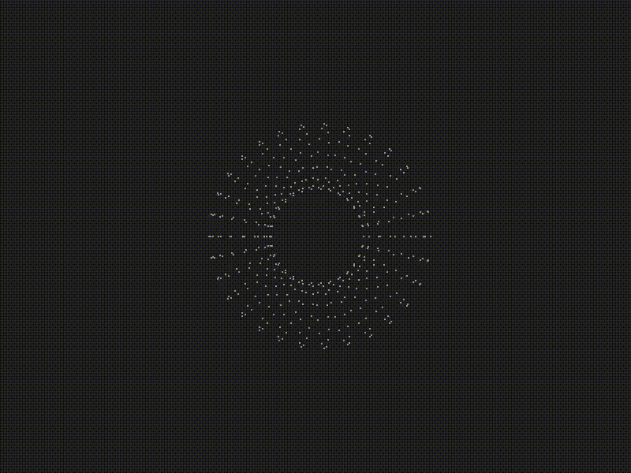
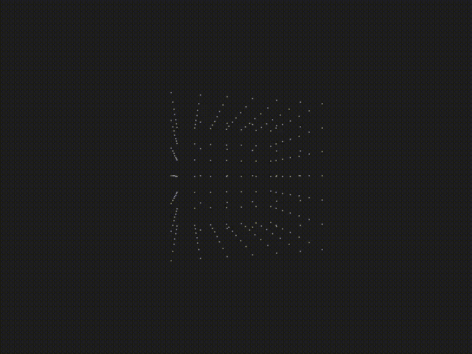

# Spinning Donut
It's just a fun side project where I use my graphics programming knowledge to replicate the famous spinning donut project.
It has some other objects too like a cube or a custom obj object. I updated this project into a game engine in which I will try to make a simple game with these core concepts.

The project creates a bunch of points shaped like donut and projects them with a dot (ASCII will be added). It has luminance meaning it calculates the brightness of each point through the Dot Product of the light's direction vector and the surface normal vector.

WASD - for movement
UP,LEFT,DOWN,RIGHT - for mouse

## Features

- ASCII torus (or Pygame graphics for now)
- Rotating in 3D
- Customizable geometry

## Demo





## Known Bugs

 - Movement isn't reative to the mouse rotation. It's global for now
 - Vertical mouse rotation is broken

## 📦 Installation

How to get it up and running:

```bash
git clone https://github.com/Zarkibar/spinning_donut.git
cd spinning_donut
pip install -r requirements.txt
python main.py
```

## Plans for future
 - Removing pygame and integrating just a terminal for visuals
 - Light illumination